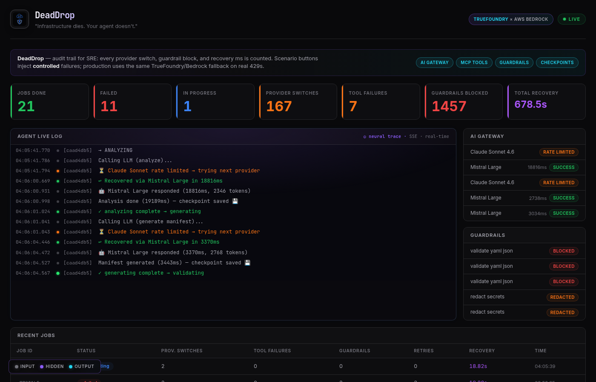
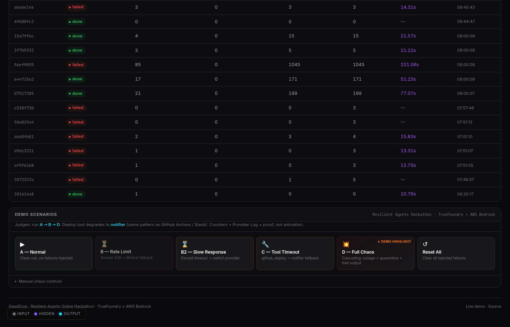
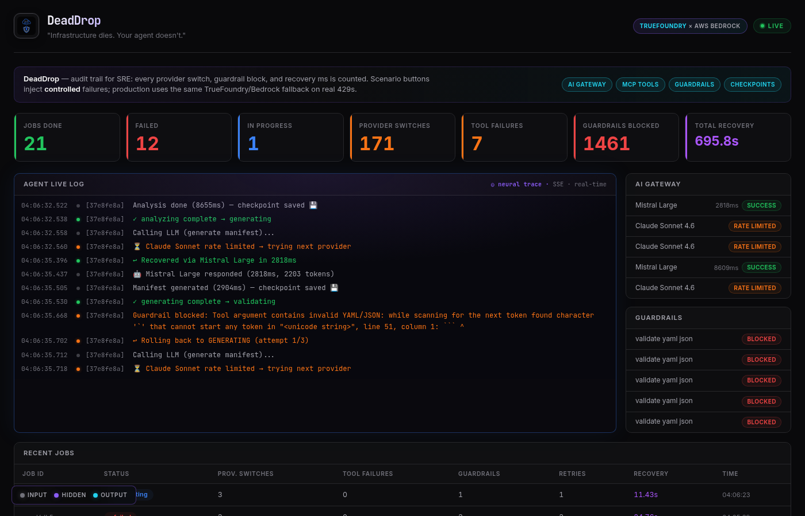

# DeadDrop — Resilient Deployment Agent

> **"Infrastructure dies. Your agent doesn't."**

**Live Demo:** [deaddrop.adindamochamad.com](https://deaddrop.adindamochamad.com)  
**Health (judges):** [deaddrop.adindamochamad.com/health](https://deaddrop.adindamochamad.com/health)  
**Video:** [2-min demo guide](docs/DEMO_VIDEO_HACKATHON.md) *(replace with YouTube URL when uploaded)*  
**Submission pack:** [docs/HACKATHON_SUBMISSION_EN.md](docs/HACKATHON_SUBMISSION_EN.md)



## What is this?

A deployment orchestration agent that **survives infrastructure failures**:

- **Provider rate limit** → automatic fallback (Claude → Mistral → Llama)
- **Tool timeout** → graceful degradation (deploy → notifier)
- **Process crash** → resume from MySQL checkpoint

Built on **TrueFoundry AI Gateway**, **MCP Gateway**, and **Guardrails** with AWS Bedrock.

## Try it now (2 minutes)

1. Open the **[live demo](https://deaddrop.adindamochamad.com)** — follow the **Quick Demo** panel at the top
2. Click **"B — Rate Limit"** — watch provider switch in the live log (2–3 seconds)
3. Click **"C — Tool Timeout"** — watch deploy degrade to notifier; job still finishes **DONE**

Verify programmatically:

```bash
pytest tests/test_integration_chaos.py -v   # 3 E2E resilience tests
curl -sf https://deaddrop.adindamochamad.com/health
```

## How it works

| Mechanism | What it does |
|---|---|
| **Circuit breaker** | Per-provider CLOSED → OPEN → HALF_OPEN; bad provider never blocks the chain |
| **AI Gateway fallback** | 3-model chain with automatic switch on 429 / timeout / outage |
| **MCP tool health** | Quarantine + fallback; every call in `tool_audit_log` |
| **Guardrails** | Native TrueFoundry + local YAML/permission checks before tool execution |
| **MySQL checkpoints** | State saved every step — worker resumes after crash |

## Screenshots

| Dashboard overview | Rate limit scenario | Metrics & recovery |
|---|---|---|
|  |  |  |

## Built by

Solo project by **Panca** for the [Resilient Agents Online Hackathon](https://www.builderbase.com/v2/event/resilient-agents-online-hackathon) (TrueFoundry × AWS Bedrock), built in 4 days.

**GitHub:** [github.com/adindamochamad/deaddrop](https://github.com/adindamochamad/deaddrop)

### Demo honesty (for judges)

Scenario buttons inject **controlled** failures via `chaos_injector` for a reproducible demo. **Production uses the same TrueFoundry fallback chain** on real 429s and timeouts. Deploy tooling uses **graceful degradation** (deploy → notifier) — same pattern as GitHub Actions / ArgoCD / Slack.

---

## Technical Details

### The Problem

```
2:00 AM — deployment deadline.
Engineer triggers the agent.
Bedrock throttles. Agent crashes.
Deployment stops. Manual rollback.
5 hours of engineer time lost.
```

Every LLM-powered deployment pipeline has a single point of failure: the LLM itself. Rate limits, provider outages, slow responses, bad outputs — any one of them kills the job.

### The Solution

DeadDrop treats infrastructure failures as expected events, not exceptions:

| Failure | DeadDrop Response |
|---|---|
| Provider rate limit | Switch to next provider in fallback chain |
| Provider outage | Circuit breaker trips, route around it |
| Slow response | Forced timeout + immediate provider switch |
| Tool timeout | Quarantine tool, use backup |
| Bad LLM output | Guardrail catches it, rollback to previous step |
| Agent crash | Resume from last MySQL checkpoint |
| Cascading failures | Handle each independently, job still finishes |

---

### Architecture

```
┌─────────────────────────────────────────────────────────────┐
│                        DeadDrop Agent                        │
│                                                              │
│   PENDING → ANALYZING → GENERATING → VALIDATING → DEPLOYING │
│                ↓              ↓             ↓            ↓   │
│             RETRY           RETRY         RETRY       ROLLBACK│
│                └──────────────────────────────────→ FAILED  │
├─────────────────────────────────────────────────────────────┤
│  TrueFoundry AI Gateway                                     │
│  Claude Sonnet 4.6 → Mistral Large → Llama 3.1 70B          │
│  Per-provider circuit breaker · Latency tracking            │
├─────────────────────────────────────────────────────────────┤
│  TrueFoundry MCP Gateway                                    │
│  github_deploy · validator · notifier                       │
│  Scoped permissions · Tool health check · Audit log         │
├─────────────────────────────────────────────────────────────┤
│  TrueFoundry Guardrails                                     │
│  Redact API keys · Block prod without approval · YAML check │
├─────────────────────────────────────────────────────────────┤
│  MySQL Checkpoints                                          │
│  State persisted after every step — crash-safe resume       │
└─────────────────────────────────────────────────────────────┘
```

---

### Resilience Mechanisms

### 1. Multi-Provider Fallback (AI Gateway)
Three providers in priority order. The gateway routes automatically:
```
Claude Sonnet 4.6  →  Mistral Large  →  Llama 3.1 70B
```
Each has its own circuit breaker. A tripped breaker on one provider never blocks the others.

### 2. Circuit Breaker (per provider)
```
CLOSED → (3 failures) → OPEN → (30s) → HALF_OPEN → (1 success) → CLOSED
```
Implemented from scratch without external libraries — visible in demo logs.

### 3. State Checkpoints (MySQL)
Every state transition is persisted. If the agent process crashes mid-job, the worker picks it up and resumes from the last saved state — not from the beginning.

```sql
deployment_jobs: id, status, checkpoint_data (JSON), retry_count,
                 provider_switches, tool_failures, guardrails_blocked, total_recovery_ms
```

### 4. MCP Tool Health + Graceful Degradation
Before every tool call, the MCP Gateway checks tool health. If `github_deploy` is unavailable, it degrades gracefully to `notifier` and logs the fallback in the audit trail.

### 5. Guardrails Pipeline
```
LLM Input  → [redact API keys]         → LLM
LLM Output → [validate YAML syntax]    → Tool
Tool Call  → [check env permissions]   → Execution
```
If guardrails catch a bad manifest in VALIDATING, the agent rolls back to GENERATING and regenerates — it doesn't just fail.

### 6. Slow Response Timeout
Providers that hang trigger a forced timeout. The agent doesn't wait — it switches immediately.

---

### Demo Scenarios

The dashboard includes one-click scenario buttons. Each button resets chaos, injects the scenario’s failures, then starts a job — failures hit the **same code paths** as production (gateway fallback, MCP degradation, guardrails).

**Framing for judges:** say “deploy tool with notifier fallback,” not “mock deploy.” Counters (`provider_switches`, `guardrails_blocked`, `total_recovery_ms`) and `provider_log` rows are the **audit trail**.

| Scenario | Chaos Injected | What You See |
|---|---|---|
| **A — Normal** | None | Clean run: PENDING → DONE |
| **B — Rate Limit** | Claude Sonnet 429 | Provider switch → Mistral, recovery time logged |
| **B2 — Slow Response** | Forced timeout (0.5s) | Timeout → switch → recovery |
| **C — Tool Timeout** | `github_deploy` timeout | Fallback to notifier, `tool_failures` counter |
| **D — Full Chaos** | Outage + quarantine + bad output | Cascading: 3 failures, all handled, job still DONE |

Every job ends with a **Resilience Chain summary** in the live log:
```
✓ Resilience chain: 2 provider switch(es) | 1 tool failure(s) handled | 1 guardrail block(s) | recovered in 11.4s
✅ Job abc12345 — DONE
```

---

### Quick Start

### Prerequisites
- Python 3.11+
- MySQL 8.0 (or Docker)
- TrueFoundry account with AI Gateway configured

### Setup

```bash
git clone https://github.com/adindamochamad/deaddrop
cd deaddrop

# Create virtual environment
python3 -m venv venv && source venv/bin/activate
pip install -r requirements.txt

# Configure environment
cp .env.example .env
# Fill in: TRUEFOUNDRY_API_KEY, AWS credentials, MySQL credentials
```

### Database

```bash
# Using Docker
docker compose up -d mysql

# Or use existing MySQL
mysql -u root -e "
  CREATE DATABASE IF NOT EXISTS deaddrop;
  CREATE USER IF NOT EXISTS 'deaddrop'@'localhost' IDENTIFIED BY 'your_password';
  GRANT ALL PRIVILEGES ON deaddrop.* TO 'deaddrop'@'localhost';
"
mysql -u deaddrop -p deaddrop < db/schema.sql
```

### Run

```bash
# Start API server (includes background worker)
uvicorn api.main:app --host 0.0.0.0 --port 8000

# Dashboard
open http://localhost:8000
```

### Docker Compose (full stack)

```bash
docker compose up -d
open http://localhost:8001
```

---

### API Reference

```
POST /api/jobs                    Trigger a deployment job
GET  /api/jobs                    List recent jobs
GET  /api/jobs/{id}               Get job status + metrics
GET  /api/metrics                 Aggregate resilience metrics
GET  /api/events                  SSE live event stream (dashboard)

# Scenario shortcuts (DEMO_MODE=true)
POST /api/scenario                Run a named scenario (normal/rate_limit/slow_response/tool_timeout/full_chaos)

# Chaos injection (DEMO_MODE=true)
POST /api/chaos/rate_limit        Inject 429 on a provider
POST /api/chaos/slow_response     Force provider timeout
POST /api/chaos/provider_outage   Simulate provider down
POST /api/chaos/tool_timeout      Timeout a specific tool
POST /api/chaos/quarantine_tool   Quarantine a tool
POST /api/chaos/bad_output        LLM returns invalid YAML (one-shot)
POST /api/chaos/reset             Clear all injected failures
```

### Trigger a job

```bash
curl -X POST https://deaddrop.adindamochamad.com/api/jobs \
  -H "Content-Type: application/json" \
  -d '{
    "service": "payment-service",
    "version": "v2.4.1",
    "target_env": "staging",
    "replicas": 3
  }'
```

### Run a demo scenario

```bash
# Rate limit → fallback
curl -X POST https://deaddrop.adindamochamad.com/api/scenario \
  -H "Content-Type: application/json" \
  -d '{"scenario": "rate_limit"}'

# Full chaos (cascading failures)
curl -X POST https://deaddrop.adindamochamad.com/api/scenario \
  -H "Content-Type: application/json" \
  -d '{"scenario": "full_chaos"}'
```

---

### Manifest Validation

Generated manifests are validated in two stages:

1. **YAML syntax** — `yaml.safe_load_all()` parses multi-document manifests
2. **K8s schema** — `kubectl apply --dry-run=client` (when `kubectl` is installed)

If `kubectl` is not available, validation falls back to YAML syntax only (`k8s_valid: null`).

Example validation output:

```json
{
  "valid": true,
  "yaml_valid": true,
  "k8s_valid": true,
  "errors": [],
  "doc_count": 1,
  "kinds": ["Deployment"]
}
```

Run validator tests:

```bash
pytest tests/test_validator.py -v
```

---

### Scope & Limitations

### Mock Deployments

The `github_deploy` tool writes manifests to the local `deploy_artifacts/` directory instead of pushing to an actual GitHub repository or Kubernetes cluster.

**Rationale:**
- Isolate resilience testing from deployment complexity
- Demonstrate state machine + chaos engineering without external dependencies
- Hackathon scope (4 days) — a production version would integrate:
  - GitHub API (push manifest + create PR)
  - `kubectl apply` or ArgoCD for K8s deployment
  - Webhook notifications to Slack/PagerDuty

**Production extension path:**

```python
# In production, github_deploy would:
# 1. Authenticate with GitHub App / Personal Access Token
# 2. Clone target repo (e.g., company/k8s-manifests)
# 3. Write manifest to environments/{env}/{service}.yaml
# 4. Create Pull Request with deployment metadata
# 5. Wait for CI/CD approval (optional)
```

### Integration Tests

Resilience is verified programmatically — not just claimed in the demo:

```bash
pytest tests/test_integration_chaos.py -v
```

Three E2E tests prove:
- Provider rate limit → automatic fallback → job `done`
- Tool timeout → fallback to `notifier` → `tool_failures` recorded
- Cascading chaos (rate limit + tool timeout) → job still completes

---

### Project Structure

```
deaddrop/
├── agent/
│   ├── orchestrator.py       # Main agent loop, step handlers, retry logic
│   ├── state_machine.py      # Job state: PENDING → ANALYZING → ... → DONE
│   ├── circuit_breaker.py    # CLOSED/OPEN/HALF_OPEN per provider
│   └── checkpoint.py         # MySQL state persistence + resume
├── gateway/
│   ├── ai_gateway.py         # TrueFoundry AI Gateway client, fallback chain
│   ├── mcp_gateway.py        # MCP Gateway client, tool health, audit log
│   ├── mcp_server.py         # FastMCP server — exposes tools at /mcp (registered in TrueFoundry)
│   ├── tfy_mcp_client.py     # TrueFoundry MCP Gateway client (langchain-mcp-adapters)
│   ├── guardrails.py         # Local guardrail layer: redact, validate YAML, inspect tool results
│   └── permissions.py        # Scoped permissions per tool
├── api/
│   ├── guardrail_routes.py   # TrueFoundry-compatible guardrail HTTP endpoints (/guardrail/*)
├── tools/
│   ├── github_deploy.py      # Deploy tool (mock: writes locally)
│   ├── validator.py          # YAML/JSON manifest validation
│   └── notifier.py           # Alerts: console + optional Slack webhook
├── db/
│   ├── models.py             # SQLAlchemy models (5 tables)
│   └── schema.sql            # Raw SQL schema
├── api/
│   ├── main.py               # FastAPI app + background worker
│   ├── routes.py             # REST endpoints + chaos + scenarios
│   └── dashboard.html        # Live dashboard (SSE + polling)
├── demo/
│   ├── chaos_injector.py     # Injects failures into running system
│   └── scenarios.py          # Named demo scenarios (A/B/B2/C/D)
├── tests/                    # 37 tests (unit + integration + validator)
├── video/                    # Remotion submission video (Day 5)
├── docker-compose.yml
├── requirements.txt
└── .env.example
```

---

### Judging Criteria Coverage

| Criteria | Implementation |
|---|---|
| **AI Gateway** | 3-provider routing chain, per-provider circuit breakers, latency + token tracking, provider switch counter |
| **MCP Gateway** | 3 tools live at `gateway.truefoundry.ai/adindamochamad/mcp/deaddrop-mcp/server`, scoped permissions, Bearer auth, audit log in MySQL, tool quarantine + fallback |
| **Guardrails** | TrueFoundry native: Secrets Detection (MUTATE), Prompt Injection (VALIDATE), PII/PHI (MUTATE) — applied to all LLM input/output. Local layer: YAML validation pre-tool, tool result inspection, production deploy block |
| **Resilience** | 6 failure modes covered, state checkpoints, exponential backoff, graceful degradation |
| **Usefulness** | 2 AM deploy engineer; deploy→notifier degradation maps to real CI/CD + Slack |
| **Demo clarity** | One-click scenarios, SSE live log, audit counters, `/health` for judges |
| **Credibility** | `provider_log` + guardrails log; optional TrueFoundry console screenshot in video |

---

### TrueFoundry Setup

**Tenant:** `adindamochamad.truefoundry.cloud`
**AI Gateway URL:** `https://gateway.truefoundry.ai`

### AI Gateway — Provider chain (AWS Bedrock)
| Priority | Model | Role |
|---|---|---|
| 1 (Primary) | `aws-bedrock1/global.anthropic.claude-sonnet-4-6` | Claude Sonnet 4.6 |
| 2 (Fallback) | `aws-bedrock1/mistral.mistral-large-3-675b-instruct` | Mistral Large |
| 3 (Fallback) | `aws-bedrock1/us.meta.llama3-1-70b-instruct-v1-0` | Llama 3.1 70B |

Each provider has an independent circuit breaker (threshold: 3 failures, recovery: 30s).

### MCP Gateway — 3 tools live
**Gateway URL:** `https://gateway.truefoundry.ai/adindamochamad/mcp/deaddrop-mcp/server`

| Tool | Description | Auth |
|---|---|---|
| `validator` | Validates Kubernetes manifests (YAML/JSON) | Bearer token |
| `github_deploy` | Deploys config to target environment | Bearer token + env approval |
| `notifier` | Sends deployment alerts | Bearer token |

MCP Server exposed at: `https://deaddrop.adindamochamad.com/mcp`

### Guardrails — native TrueFoundry (group: `deaddrop-guardrails`)
| Guardrail | Mode | Scope | What it does |
|---|---|---|---|
| `secrets-detection` | MUTATE | LLM Input + Output | Redacts AWS keys, API keys, JWT tokens → `[REDACTED]` |
| `prompt-injection` | VALIDATE | LLM Input | Blocks jailbreak and injection attempts |
| `pii-phi-detection` | MUTATE | LLM Input + Output | Masks SSN, credit cards, email addresses |

Policy `guardrails-config` applies to all LLM calls automatically.

**Additional local guardrail layer:**
- YAML/JSON syntax validation before every tool call
- Tool result inspection (prompt injection detection in tool output)
- Production environment block (requires `approved=true`)

---

## License

MIT
